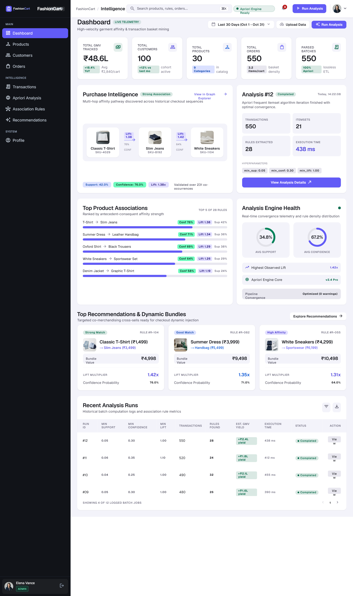
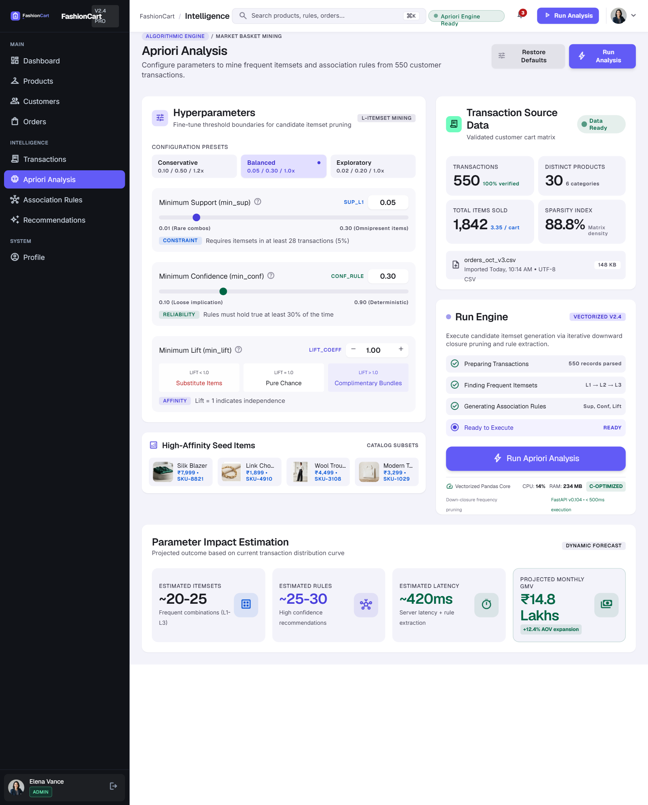
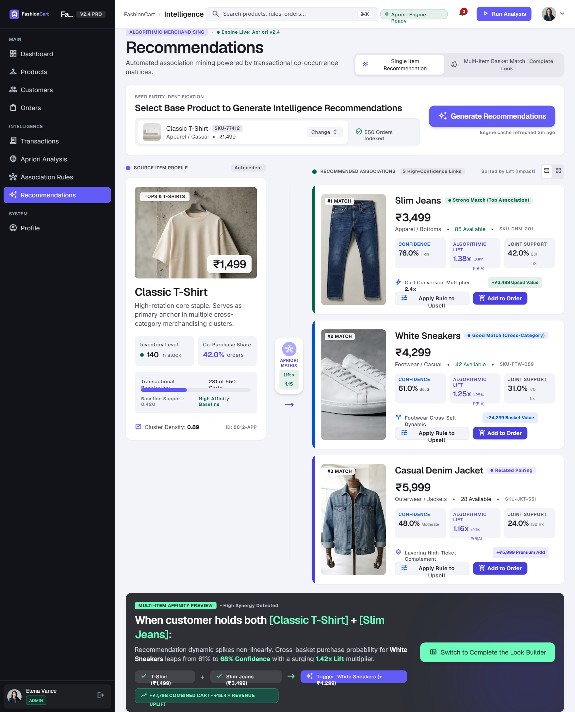

# FashionCart Intelligence — Deployment-Ready Full Stack

FashionCart is a complete purchase-pattern intelligence platform for fashion retail. It combines a **FastAPI + MySQL backend** with a **responsive Stitch-inspired analytical UI** and uses the **Apriori algorithm** to discover frequent itemsets, association rules, and product recommendations.

This repository supports **two deployment paths**:

1. **Vercel + Cloudflare DNS + managed MySQL** — the recommended cloud/demo path. Vercel serves the FastAPI application and the same frontend on one origin; Cloudflare can remain the DNS provider.
2. **Docker Compose** — the original self-hosted path using Nginx + FastAPI + MySQL.

> **Cloud deploy:** [Vercel + Cloudflare guide](VERCEL_CLOUDFLARE_DEPLOY.md) · **Docs:** [Deployment](docs/DEPLOYMENT.md) · [API reference](docs/API_REFERENCE.md) · [Interview demo](INTERVIEW_DEMO.md) · [Portfolio & resume kit](docs/PORTFOLIO_AND_RESUME.md) · [Audit report](docs/AUDIT_REPORT.md)

## What is included

### UI
- Premium dark-rail / light-canvas design derived from the supplied Stitch design system
- Login and registration
- Role-aware navigation for ADMIN / ANALYST / USER
- Dashboard with KPI cards, strongest rule, engine health, top associations and analysis history
- Product list, search/filter/sort, product detail, create, edit and delete
- Customer list/search, create and customer order history
- Order list/filter, order builder, stock-aware quantity controls and order detail
- CSV transaction upload with drag-and-drop, validation summary and imported basket view
- Apriori configuration, run progress, analysis history and detail
- Association-rules table with support/confidence/lift filters and inspection drawer
- Single-item and multi-item recommendations
- Profile editing and password change
- Loading skeletons, empty states, error states, confirmation modals, toasts and responsive/mobile navigation
- Live data-driven notification drawer, customer-aware global search and mobile “More” navigation
- Analysis result export to JSON

### Backend
- Python / FastAPI REST API
- SQLAlchemy 2 + MySQL 8
- JWT authentication and role-based authorization
- Password hashing
- Product CRUD plus customer/order management workflow
- Backend order-total and stock validation
- CSV validation/import and persisted transaction baskets
- Reusable Apriori engine
- Support, confidence and lift calculations
- Persisted analysis runs, itemsets and association rules
- Recommendations from stored rules (no Apriori recalculation per request)
- Dashboard metrics
- Centralized errors and request logging
- Server-side pagination, search, sort and filtering on every list (true totals, e.g. "Showing 1-25 of 550")
- Role-specific home: shoppers (USER) get a pairing/recommendation experience instead of a filtered admin dashboard
- Rate limiting on login, registration and CSV upload (`429` + `Retry-After`); optional `ALLOW_REGISTRATION=false` for public demos
- Strict Content-Security-Policy and security headers on the static app (Nginx)
- Swagger/OpenAPI and ReDoc
- Pytest coverage
- Demo seed generator

## Architecture

```text
Browser
   |
   v
Nginx frontend :80
   |---------------- serves static FashionCart UI
   |
   +---- /api/* --------------------+
                                     v
                              FastAPI :8000
                                  |
                    +-------------+-------------+
                    |                           |
             Service/Repository           Apriori Engine
                    |                           |
                    +-------------+-------------+
                                  |
                                  v
                               MySQL 8
```

## Vercel + Cloudflare quick start

This ZIP now includes the files Vercel needs at the repository root:

- `index.py` — Vercel FastAPI entrypoint; mounts the existing frontend after API routes
- `requirements.txt` — production Python dependencies
- `.python-version` — Python 3.12
- `vercel.json` — FastAPI/function/security configuration
- `.vercelignore` — keeps tests/design/Docker-only files out of the function bundle
- `.env.vercel.example` — required environment-variable template
- `VERCEL_CLOUDFLARE_DEPLOY.md` — exact deployment + Cloudflare DNS steps

You still need a persistent **managed MySQL** database and must enter its `DATABASE_URL` plus a strong `JWT_SECRET` in Vercel before deployment. Cloudflare should initially be used as **DNS only** for the Vercel hostname rather than as a second reverse proxy/CDN.

See `VERCEL_CLOUDFLARE_DEPLOY.md` for the complete sequence.

## Fast start

### 1. Configure secrets

```bash
cp .env.example .env
```

Change at minimum:
- `MYSQL_PASSWORD`
- `MYSQL_ROOT_PASSWORD`
- `JWT_SECRET`

Generate a JWT secret with:

```bash
python -c "import secrets; print(secrets.token_urlsafe(48))"
```

### 2. Start the full stack

```bash
docker compose up --build -d
```

### 3. Seed realistic demo data

```bash
docker compose --profile tools run --rm seed
```

### 4. Open the application

- App: `http://localhost:3000`
- Swagger: `http://localhost:3000/docs`
- ReDoc: `http://localhost:3000/redoc`
- Health: `http://localhost:3000/health`

For direct backend/MySQL ports during development:

```bash
docker compose -f docker-compose.yml -f docker-compose.dev.yml up --build
```

Then the API is also at `http://localhost:8000` and MySQL at `localhost:3306`.

## Demo accounts

After running the seed command:

| Role | Email | Password |
|---|---|---|
| ADMIN | `admin@fashioncart.dev` | `Admin@123` |
| ANALYST | `analyst@fashioncart.dev` | `Analyst@123` |
| USER | `user@fashioncart.dev` | `User@123` |

These are demo credentials only. Do not use them for a public production deployment.

## Demo dataset

The included seed generator creates:
- 100 customers
- 30 fashion products
- 550 completed orders
- 1,552 order items with deliberately meaningful co-purchase patterns

Using the default Apriori parameters (`support=0.05`, `confidence=0.30`, `lift=1.0`) the verified seed run produced:
- 550 transactions
- 21 frequent itemsets
- 28 association rules

## Main API

### Authentication
- `POST /api/auth/register`
- `POST /api/auth/login`
- `GET /api/auth/me`
- `PUT /api/auth/me`
- `POST /api/auth/change-password`

### Products
- `POST /api/products` — ADMIN
- `GET /api/products`
- `GET /api/products/{id}`
- `PUT /api/products/{id}` — ADMIN
- `DELETE /api/products/{id}` — ADMIN

### Customers / Orders
- `POST /api/customers`
- `GET /api/customers`
- `GET /api/customers/{id}`
- `GET /api/customers/{id}/orders`
- `POST /api/orders`
- `GET /api/orders`
- `GET /api/orders/stats`
- `GET /api/orders/{id}`
- `POST /api/orders/{id}/items`

### Transactions
- `POST /api/transactions/upload`
- `GET /api/transactions`
- `GET /api/transactions/stats`

CSV format:

```csv
transaction_id,product
1001,Classic T-Shirt
1001,Slim Jeans
1001,White Sneakers
1002,Summer Dress
1002,Leather Handbag
```

### Apriori
- `POST /api/analysis/run`
- `GET /api/analysis`
- `GET /api/analysis/{id}`
- `GET /api/analysis/{id}/rules`
- `GET /api/analysis/{id}/itemsets`

Example run:

```json
{
  "min_support": 0.05,
  "min_confidence": 0.30,
  "min_lift": 1.0
}
```

### Recommendations
- `GET /api/recommendations/{product_name}`
- `POST /api/recommendations`

Recommendations are ranked by **lift**, then **confidence**, then **support**.


## Sample API responses

Values below come from the seeded demo dataset (CSV counts are illustrative of the format).

Login:

```json
{
  "access_token": "<jwt>",
  "token_type": "bearer",
  "user": {"id": 2, "name": "FashionCart Analyst", "email": "analyst@fashioncart.dev", "role": "ANALYST"}
}
```

CSV import:

```json
{
  "total_rows": 5000,
  "valid_rows": 4872,
  "invalid_rows": 128,
  "duplicate_rows": 25,
  "status": "completed"
}
```

Apriori analysis:

```json
{
  "analysis_id": 12,
  "transaction_count": 550,
  "frequent_itemsets": 21,
  "association_rules": 28,
  "execution_time_ms": 438,
  "status": "completed"
}
```

Recommendation:

```json
{
  "product": "Classic T-Shirt",
  "recommendations": [
    {"product": "Slim Jeans", "confidence": 0.85, "lift": 6.69, "support": 0.125}
  ]
}
```

## Roles

### ADMIN
Full application access, including product creation/edit/delete, orders, imports and analysis.

### ANALYST
Dashboard, customers, orders, transactions, Apriori, rules and recommendations. Product catalog is readable but product mutation stays admin-only.

### USER
Dashboard, product catalog, recommendations and profile.

## Tests and validation

Run locally after installing development dependencies:

```bash
cd backend
python -m venv .venv
# Windows: .venv\Scripts\activate
# macOS/Linux: source .venv/bin/activate
pip install -r requirements-dev.txt
pytest -q
```

The final audited project passes **38 backend tests plus a jsdom frontend smoke test**, including Apriori persistence and historical-product deletion conflict coverage. Python source compilation, frontend JavaScript syntax, OpenAPI route generation and Docker Compose YAML parsing were also validated.

## Deployment

For Vercel + Cloudflare DNS, use [`VERCEL_CLOUDFLARE_DEPLOY.md`](VERCEL_CLOUDFLARE_DEPLOY.md). For Docker/VPS deployment, use [`docs/DEPLOYMENT.md`](docs/DEPLOYMENT.md).
See [`docs/API_REFERENCE.md`](docs/API_REFERENCE.md) for endpoint access, status codes, request/response examples and error envelopes.
See [`docs/GIT_COMMIT_PLAN.md`](docs/GIT_COMMIT_PLAN.md) for a clean GitHub commit sequence if you import this ZIP into a new repository.

On Vercel, the same FastAPI app serves `/api` plus the frontend on one origin and connects to managed MySQL. On Docker, only Nginx is exposed publicly while MySQL stays private.

## Project structure

```text
FashionCart/
├── index.py                  # Vercel FastAPI entrypoint
├── vercel.json              # Vercel runtime/security config
├── .env.vercel.example      # Vercel environment template
├── .vercelignore
├── .python-version
├── requirements.txt         # Vercel production dependencies
├── VERCEL_CLOUDFLARE_DEPLOY.md
├── backend/
│   ├── app/
│   │   ├── api/
│   │   ├── algorithms/
│   │   ├── core/
│   │   ├── models/
│   │   ├── repositories/
│   │   ├── schemas/
│   │   └── services/
│   ├── scripts/seed.py
│   ├── tests/
│   ├── Dockerfile
│   └── requirements*.txt
├── frontend/
│   ├── index.html
│   ├── app.js
│   ├── ui.js
│   ├── styles.css
│   ├── nginx.conf
│   └── Dockerfile
├── data/
├── design_reference/
├── docs/
├── postman/
├── docker-compose.yml
├── docker-compose.dev.yml
├── .env.example
└── README.md
```

## Stitch design reference

The original supplied Stitch design language is preserved under `design_reference/`, including the design system and reference screens. The deployed UI uses the same core visual language: midnight navigation chrome, soft analytical surfaces, indigo primary actions, emerald positive metrics, compact quantitative tags and low-text/high-information layouts.


## Design reference (Stitch mockups)

> These are the original **design mockups**, not screenshots of the running app. Add real screenshots of the deployed UI under `docs/screenshots/` and link them here.

The supplied Stitch screens are preserved in the repository and were used as the visual source for the integrated frontend:

### Dashboard


### Apriori analysis


### Recommendations


The runtime frontend in `frontend/` uses the same navigation, analytical cards, indigo/emerald metric language and low-text layout while connecting the controls to the real FastAPI backend.

## How this demonstrates backend engineering skills

- **Python** → transaction processing and Apriori engine
- **FastAPI** → typed REST backend and OpenAPI
- **MySQL** → relational persistence and indexes
- **JWT** → authentication
- **RBAC** → route-level authorization
- **Pydantic** → input/output validation
- **Repository + service layers** → business/data-access separation
- **Pytest** → automated backend verification
- **Vercel** → autoscaling FastAPI + same-origin frontend cloud deployment
- **Cloudflare DNS** → external domain/DNS management without double-proxying Vercel
- **Docker** → reproducible self-hosted full-stack deployment
- **Nginx** → same-origin static hosting and API reverse proxy for the Docker path
- **Logging/error handling** → operational debugging
- **Apriori** → explainable purchase-pattern intelligence

## Interview demonstration flow

1. Sign in as Analyst.
2. Open the Dashboard and explain stored transaction metrics.
3. Upload a CSV under Transactions.
4. Open Apriori Analysis and run the default thresholds.
5. Open the completed analysis and explain support/confidence/lift.
6. Inspect Association Rules and open a rule drawer.
7. Open Recommendations and generate a single-product recommendation.
8. Switch to Basket mode and request multi-item recommendations.
9. Sign in as Admin to show product CRUD and role separation.

See `INTERVIEW_DEMO.md` for a concise speaking script.


## Future enhancements

For a long-lived internet-scale deployment, the next upgrades would be Alembic database migrations, automated backups, distributed rate limiting, observability/alerting, refresh/revocation for auth tokens, asynchronous analysis jobs for very large datasets, and richer merchandising experiments around the stored association rules.
