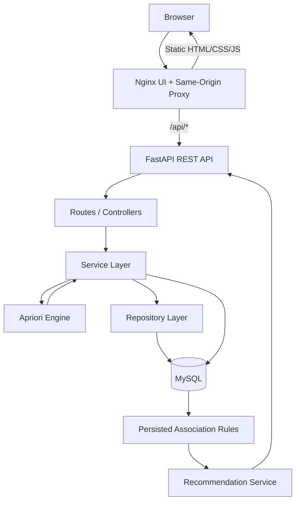
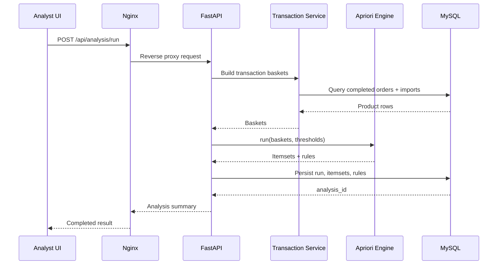

# FashionCart Architecture

```mermaid
flowchart TD
    B[Browser] --> N[Nginx UI + Same-Origin Proxy]
    N -->|Static HTML/CSS/JS| B
    N -->|/api/*| API[FastAPI REST API]
    API --> R[Routes / Controllers]
    R --> S[Service Layer]
    S --> A[Apriori Engine]
    S --> RP[Repository Layer]
    A --> S
    RP --> DB[(MySQL)]
    S --> DB
    DB --> RR[Persisted Association Rules]
    RR --> REC[Recommendation Service]
    REC --> API
```

## Analysis sequence

```mermaid
sequenceDiagram
    participant U as Analyst UI
    participant N as Nginx
    participant API as FastAPI
    participant TS as Transaction Service
    participant AP as Apriori Engine
    participant DB as MySQL
    U->>N: POST /api/analysis/run
    N->>API: Reverse proxy request
    API->>TS: Build transaction baskets
    TS->>DB: Query completed orders + imports
    DB-->>TS: Product rows
    TS-->>API: Baskets
    API->>AP: run(baskets, thresholds)
    AP-->>API: Itemsets + rules
    API->>DB: Persist run, itemsets, rules
    DB-->>API: analysis_id
    API-->>N: Analysis summary
    N-->>U: Completed result
```
